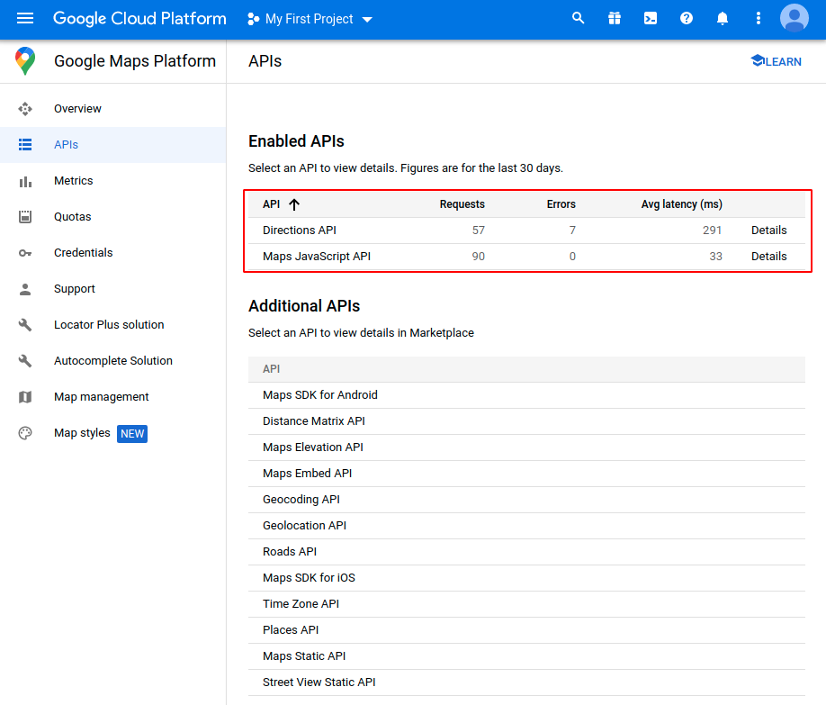

# GovHack-2021

## Installing the Application (First Time):

#### PREREQUISITES:
Applications required:
- Docker
- NPM
- Git
- Terminal
- Google Chrome

> Note: This step is only required for Google Map features in the Journey Planner
> Create a Google Cloud API Key with following APIs enabled
>  - [Maps Javascript API](https://developers.google.com/maps/documentation/javascript/get-api-key)
>  - [Directions API](https://developers.google.com/maps/documentation/directions/get-api-key)
>
> Ensure that the following APIs are enabled
> 
> 

#### 0. Getting the Resources
Clone this git repository

Make sure that the branch is pointed at 'main'

#### 1. Create the additional folders
Open Terminal

Change the directory (cd) to the top level of this repository (i.e in this level you should see the init_folders.sh)

run: <code>bash init_folders.sh</code>

When the terminal returns go to the next step

#### 2. Build the react app
change directory into xample/client/webapp (you should be able to successfully run: cd xample/client/webapp)

> Note: This step is only required for Google Map features in the Journey Planner
> 
> In the .env file, set
> REACT_APP_GOOGLE_MAP_API_KEY=<YOUR_API_KEY>

run: <code>npm install</code>

(this will take a short while)

when the terminal returns

run: <code>npm run build</code>

(this will take a short while)

when the terminal returns

run: <code>npm run start</code>

(this will take a short while as well)

#### 3. Create the images and run
From a <b>new</b> terminal

run: <code>docker-compose up --build</code>

(This will take a while) Wait a moment before proceeding to the next step

#### 4. Open application
On Chrome, direct to http://localhost:3000

You need to view this in mobile mode

(Follow this to open in mobile mode: https://www.browserstack.com/guide/view-mobile-version-of-website-on-chrome)

Change the view to "iPhone X"

## How to Stop:
run: <code>docker-compose down</code>

## How to Restart:
run: <code>docker-compose up</code>
